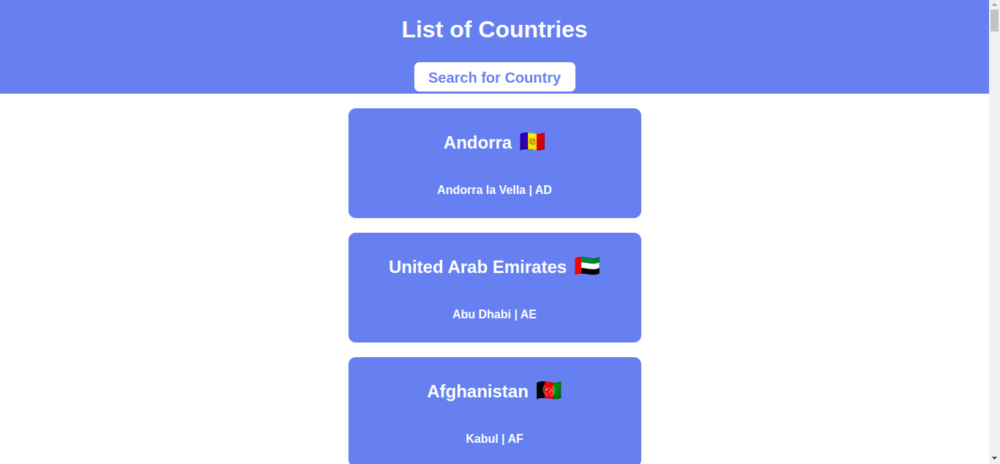
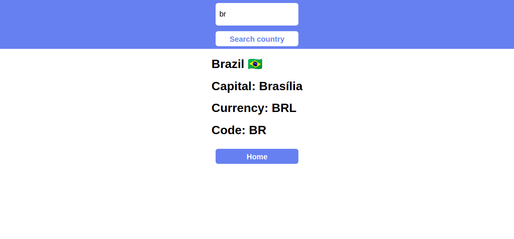

<h1>Buscar países com GraphQL</h1>

  
Neste projeto, para aprender sobre o GraphQL, utilizei a API disponível <a href="https://github.com/trevorblades/countries">neste link</a>. Para o front-end, utilizei uma aplicação React simples com duas páginas: uma homepage com todos os países listados, e uma página de pesquisa de países pelo código internacional deles.

  <h2>Páginas da aplicação</h2>
  <h3>Homepage</h3>
  
  <h3>Pesquisar país</h3>
  

  <h2>Sobre o projeto</h2>
  
Este projeto foi guiado pelo canal <a href="https://www.youtube.com/channel/UC8S4rDRZn6Z_StJ-hh7ph8g">PedroTech</a>. Meu objetivo com este projeto é desenvolver ainda mais meus conhecimentos sobre GraphQL como alternativa a APIs REST, então ainda serão adicionadas novas funcionalidades e um CSS mais completo, para que a UI fique mais agradável.

